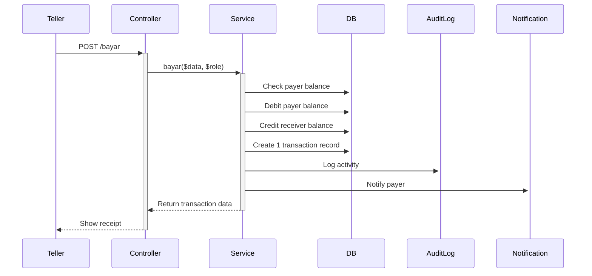

# Payment System Documentation

**🌐 Language:** [English](PAYMENT_SYSTEM.md) | [Bahasa Indonesia](PAYMENT_SYSTEM_ID.md)

---

## Table of Contents
1. [Overview](#overview)
2. [Architecture](#architecture)
3. [Features](#features)
4. [Transaction Flow](#transaction-flow)
5. [Database Schema](#database-schema)
6. [API Endpoints](#api-endpoints)
7. [Frontend Components](#frontend-components)
8. [Receipt Templates](#receipt-templates)
9. [Testing Guide](#testing-guide)

---

## Overview

The Payment System is a single-transaction architecture designed to handle payments from customers to payment accounts (e.g., "School Uniform", "Monthly Fee"). Unlike transfers which create two transaction records, payments create only one record on the payer's side while still updating both account balances.

**Key Characteristics:**
- ✅ Single transaction record per payment
- ✅ Dual perspective: Payer view and Receiver view
- ✅ Automatic balance updates for both parties
- ✅ Specialized receipts for each perspective
- ✅ Clean transaction history (no duplicates)

---

## Architecture

### Transaction Model
```
Payment: Customer A → Payment Account "Uniform" → Rp 50,000

┌─────────────────────────────────────────┐
│ Database: Only 1 Transaction Record     │
├─────────────────────────────────────────┤
│ nasabah_id: A (payer)                   │
│ nasabah_tujuan_id: Uniform (receiver)   │
│ jenis_transaksi: bayar                  │
│ jumlah: 50000                           │
│ saldo_sebelum: 100000 (A's balance)    │
│ saldo_sesudah: 50000 (A's balance)     │
└─────────────────────────────────────────┘

Balance Updates:
├─ Customer A: 100,000 → 50,000 ✓
└─ Uniform Account: 0 → 50,000 ✓

View by Customer A (Payer):
├─ Query: WHERE nasabah_id = A
├─ Badge: 🔴 PAYMENT OUT
└─ Info: "School Uniform"

View by Uniform Account (Receiver):
├─ Query: WHERE nasabah_tujuan_id = Uniform
├─ Badge: 🟢 PAYMENT IN
└─ Info: "From: Customer A"
```

---

## Features

### 1. Single Transaction Logic
- Payment creates **1 database record** (on payer's `nasabah_id`)
- Reference to receiver stored in `nasabah_tujuan_id`
- Both account balances updated automatically

### 2. Dual Query System
**Payer's History:**
```sql
SELECT * FROM transaksi 
WHERE nasabah_id = [payer_id]
```

**Payment Account's History:**
```sql
SELECT * FROM transaksi 
WHERE nasabah_tujuan_id = [account_id] 
  AND jenis_transaksi = 'bayar'
```

### 3. Perspective-Based Display
- **Payer View**: Shows payment type/category name
- **Receiver View**: Shows payer's name and account number
- Different receipt templates for each perspective

### 4. Dashboard Statistics
New statistics added:
- `total_bayar`: Sum of all payments today
- Displayed in both Teller and Superadmin dashboards
- Color: Amber/Yellow for visual distinction

---

## Transaction Flow

### Making a Payment



### Viewing Transaction History

**Payer Perspective:**
1. Login as payer account
2. Navigate to Transaction History
3. See payment as: 🔴 "PAYMENT" with payment type

**Receiver Perspective:**
1. Login as payment account
2. Navigate to Transaction History  
3. See payment as: 🟢 "RECEIVED PAYMENT" with payer info

---

## Database Schema

### Transaksi Table
```sql
CREATE TABLE transaksi (
    id BIGINT PRIMARY KEY,
    kode_transaksi VARCHAR(50) UNIQUE,
    nasabah_id BIGINT,              -- Payer (owner)
    nasabah_tujuan_id BIGINT,       -- Payment account (reference)
    user_id BIGINT,                 -- Teller who processed
    jenis_transaksi VARCHAR(20),    -- 'bayar'
    jumlah DECIMAL(15,2),
    saldo_sebelum DECIMAL(15,2),    -- Payer's balance before
    saldo_sesudah DECIMAL(15,2),    -- Payer's balance after
    tanggal_transaksi DATETIME,
    keterangan TEXT,
    nama_petugas VARCHAR(255),
    status VARCHAR(20),
    created_at TIMESTAMP,
    updated_at TIMESTAMP,
    
    FOREIGN KEY (nasabah_id) REFERENCES nasabah(id),
    FOREIGN KEY (nasabah_tujuan_id) REFERENCES nasabah(id),
    FOREIGN KEY (user_id) REFERENCES users(id)
);
```

**Key Fields:**
- `nasabah_id`: Always the payer
- `nasabah_tujuan_id`: Payment account reference (enables dual query)
- `saldo_sebelum/sesudah`: Payer's balance snapshot

---

## API Endpoints

### Create Payment
```http
POST /{role}/bayar
Content-Type: application/json

{
    "pengirim_rekening": "001.001.001",
    "penerima_rekening": "999.999.001",
    "jumlah": 50000,
    "tanggal_transaksi": "2026-06-18 10:30:00",
    "keterangan": "Optional note",
    "nama_petugas": "Teller 1"
}
```

**Response:**
```json
{
    "kode_transaksi": "BYR20260618103045ABCD",
    "no_urut": 15,
    "nasabah_name": "John Doe",
    "nasabah_norek": "001.001.001",
    "jenis_pembayaran": "School Uniform",
    "penerima_name": "School Uniform",
    "penerima_norek": "999.999.001",
    "jumlah": 50000,
    "saldo_sebelum": 100000,
    "saldo_sesudah": 50000,
    "jenis_transaksi": "bayar",
    "tanggal": "18/06/26 10:30:45",
    "petugas": "Teller 1"
}
```

### Cancel Payment
```http
POST /{role}/transaction/{id}/cancel
Content-Type: application/json

{
    "reason": "Customer request"
}
```

**Process:**
1. Reverse payer balance (add back)
2. Reverse receiver balance (subtract)
3. Mark transaction as cancelled

---

## Frontend Components

### 1. Payment Form (`Bayar.tsx`)
**Location:** `/resources/js/pages/shared/Transaction/Bayar.tsx`

**Features:**
- Account number lookup
- Payment account selection dropdown
- Amount validation
- Transaction confirmation modal
- Receipt display on success

### 2. Transaction History (`Transaksi.tsx`)
**Location:** `/resources/js/pages/nasabah/Transaksi.tsx`

**Features:**
- Detects `is_incoming_payment` flag
- Different badges for payer vs receiver
- Filters and date range search
- Receipt preview

### 3. Receipt Component (`Receipt.tsx`)
**Location:** `/resources/js/components/Receipt.tsx`

**Features:**
- Auto-detects perspective (payer/receiver)
- Dynamic labels based on transaction type
- Print functionality
- Passbook printer integration

### 4. Dashboard Statistics
**Locations:**
- `/resources/js/pages/teller/Dashboard.tsx`
- `/resources/js/pages/superadmin/Dashboard.tsx`

**New Card:**
```tsx
<div className="rounded-xl bg-linear-to-br from-amber-50 to-white">
    <div className="flex items-center gap-3">
        <div className="h-12 w-12 bg-amber-100">
            <svg><!-- Wallet icon --></svg>
        </div>
        <div>
            <p>Total Pembayaran</p>
            <p>{formatRupiah(stats.total_bayar)}</p>
            <p>Hari Ini</p>
        </div>
    </div>
</div>
```

---

## Receipt Templates

### Payer Receipt
```
═══════════════════════════════════
  BANK MINI SCHOOL
  TRANSACTION: PAYMENT
═══════════════════════════════════
ORDER NO     : 15
TRANS TYPE   : PAYMENT

PAYMENT
AMOUNT       : Rp     50,000.00
───────────────────────────────────
ACCOUNT NO   : 001.001.001
NAME         : John Doe
PAYMENT TYPE : School Uniform
───────────────────────────────────
RECEIPT NO   : BYR20260618103045
TELLER       : Teller 1
═══════════════════════════════════
   THIS RECEIPT IS VALID PROOF
      OF TRANSACTION
═══════════════════════════════════
```

### Receiver Receipt
```
═══════════════════════════════════
  BANK MINI SCHOOL
  TRANSACTION: RECEIVED PAYMENT
═══════════════════════════════════
ORDER NO     : 15
TRANS TYPE   : PAYMENT RECEIVED

RECEIVED
AMOUNT       : Rp     50,000.00
───────────────────────────────────
FROM         : 001.001.001
NAME         : John Doe
───────────────────────────────────
RECEIPT NO   : BYR20260618103045
TELLER       : Teller 1
═══════════════════════════════════
   THIS RECEIPT IS VALID PROOF
      OF TRANSACTION
═══════════════════════════════════
```

---

## Testing Guide

### Backend Tests

**Test Payment Creation:**
```php
public function test_payment_creates_single_transaction()
{
    $payer = Nasabah::factory()->create(['saldo' => 100000]);
    $receiver = Nasabah::factory()->create(['saldo' => 0]);
    
    $response = $this->post('/teller/bayar', [
        'pengirim_rekening' => $payer->nomor_rekening,
        'penerima_rekening' => $receiver->nomor_rekening,
        'jumlah' => 50000,
        // ...
    ]);
    
    // Assert: Only 1 transaction created
    $this->assertDatabaseCount('transaksi', 1);
    
    // Assert: Balances updated
    $this->assertEquals(50000, $payer->fresh()->saldo);
    $this->assertEquals(50000, $receiver->fresh()->saldo);
}
```

**Test Dual Query:**
```php
public function test_payment_appears_in_both_histories()
{
    // Create payment...
    
    // Payer view
    $payerHistory = Transaksi::where('nasabah_id', $payer->id)->get();
    $this->assertCount(1, $payerHistory);
    
    // Receiver view
    $receiverHistory = Transaksi::where('nasabah_tujuan_id', $receiver->id)
        ->where('jenis_transaksi', 'bayar')
        ->get();
    $this->assertCount(1, $receiverHistory);
}
```

### Manual Testing Checklist

- [ ] Create payment transaction from teller
- [ ] Verify payer balance decreased
- [ ] Verify receiver balance increased
- [ ] Check payer history (shows "PAYMENT")
- [ ] Check receiver history (shows "RECEIVED PAYMENT")
- [ ] View receipt from payer perspective
- [ ] View receipt from receiver perspective
- [ ] Test payment cancellation
- [ ] Verify dashboard statistics updated
- [ ] Test with different payment accounts

---

**📅 Last Updated:** June 18, 2026  
**📝 Version:** 1.0.0  
**👥 Contributors:** Development Team

**📚 Related Documentation:**
- [Features Documentation](./PAYMENT_SYSTEM.md) - Features Complete Documentation
- [Quick Start Guide](./QUICK_START.md) - Quick Start Guide
- [API Documentation](#) - API DOcumentation (coming soon)
