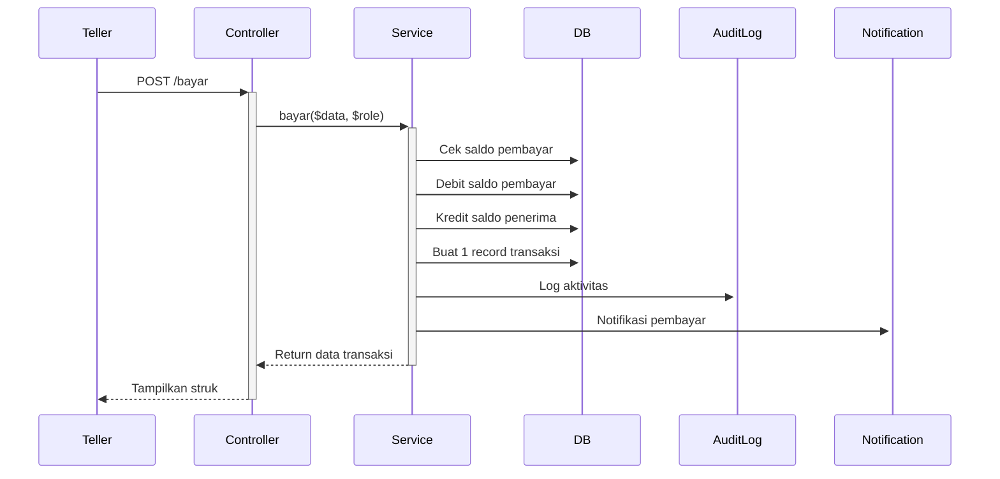

# Dokumentasi Sistem Pembayaran

**🌐 Bahasa:** [English](PAYMENT_SYSTEM.md) | [Bahasa Indonesia](PAYMENT_SYSTEM_ID.md)

---

## Daftar Isi
1. [Gambaran Umum](#gambaran-umum)
2. [Arsitektur](#arsitektur)
3. [Fitur](#fitur-id)
4. [Alur Transaksi](#alur-transaksi)
5. [Skema Database](#skema-database)
6. [Endpoint API](#endpoint-api)
7. [Komponen Frontend](#komponen-frontend)
8. [Template Struk](#template-struk)
9. [Panduan Testing](#panduan-testing)

---

## Gambaran Umum

Sistem Pembayaran adalah arsitektur transaksi tunggal yang dirancang untuk menangani pembayaran dari nasabah ke akun pembayaran (mis. "Seragam Sekolah", "Biaya Bulanan"). Berbeda dengan transfer yang membuat dua record transaksi, pembayaran hanya membuat satu record di sisi pembayar sambil tetap memperbarui saldo kedua akun.

**Karakteristik Utama:**
- ✅ Satu record transaksi per pembayaran
- ✅ Perspektif ganda: Tampilan pembayar dan penerima
- ✅ Pembaruan saldo otomatis untuk kedua pihak
- ✅ Struk khusus untuk setiap perspektif
- ✅ Riwayat transaksi bersih (tanpa duplikat)

---

## Arsitektur

### Model Transaksi
```
Pembayaran: Nasabah A → Akun Pembayaran "Seragam" → Rp 50.000

┌─────────────────────────────────────────┐
│ Database: Hanya 1 Record Transaksi      │
├─────────────────────────────────────────┤
│ nasabah_id: A (pembayar)                │
│ nasabah_tujuan_id: Seragam (penerima)   │
│ jenis_transaksi: bayar                  │
│ jumlah: 50000                           │
│ saldo_sebelum: 100000 (saldo A)        │
│ saldo_sesudah: 50000 (saldo A)         │
└─────────────────────────────────────────┘

Pembaruan Saldo:
├─ Nasabah A: 100.000 → 50.000 ✓
└─ Akun Seragam: 0 → 50.000 ✓

Tampilan Nasabah A (Pembayar):
├─ Query: WHERE nasabah_id = A
├─ Badge: 🔴 BAYAR
└─ Info: "Seragam Sekolah"

Tampilan Akun Seragam (Penerima):
├─ Query: WHERE nasabah_tujuan_id = Seragam
├─ Badge: 🟢 TERIMA BAYAR
└─ Info: "Dari: Nasabah A"
```

---

## Fitur (ID)

### 1. Logic Transaksi Tunggal
- Pembayaran membuat **1 record database** (di `nasabah_id` pembayar)
- Referensi penerima disimpan di `nasabah_tujuan_id`
- Saldo kedua akun diperbarui otomatis

### 2. Sistem Query Ganda
**Riwayat Pembayar:**
```sql
SELECT * FROM transaksi 
WHERE nasabah_id = [id_pembayar]
```

**Riwayat Akun Pembayaran:**
```sql
SELECT * FROM transaksi 
WHERE nasabah_tujuan_id = [id_akun] 
  AND jenis_transaksi = 'bayar'
```

### 3. Tampilan Berbasis Perspektif
- **Tampilan Pembayar**: Menampilkan jenis/kategori pembayaran
- **Tampilan Penerima**: Menampilkan nama dan nomor rekening pembayar
- Template struk berbeda untuk setiap perspektif

### 4. Statistik Dashboard
Statistik baru ditambahkan:
- `total_bayar`: Jumlah semua pembayaran hari ini
- Ditampilkan di dashboard Teller dan Superadmin
- Warna: Amber/Kuning untuk pembedaan visual

---

## Alur Transaksi

### Melakukan Pembayaran



### Melihat Riwayat Transaksi

**Perspektif Pembayar:**
1. Login sebagai akun pembayar
2. Navigasi ke Riwayat Transaksi
3. Lihat pembayaran sebagai: 🔴 "BAYAR" dengan jenis pembayaran

**Perspektif Penerima:**
1. Login sebagai akun pembayaran
2. Navigasi ke Riwayat Transaksi
3. Lihat pembayaran sebagai: 🟢 "TERIMA BAYAR" dengan info pembayar

---

## Skema Database

### Tabel Transaksi
```sql
CREATE TABLE transaksi (
    id BIGINT PRIMARY KEY,
    kode_transaksi VARCHAR(50) UNIQUE,
    nasabah_id BIGINT,              -- Pembayar (pemilik)
    nasabah_tujuan_id BIGINT,       -- Akun pembayaran (referensi)
    user_id BIGINT,                 -- Teller yang memproses
    jenis_transaksi VARCHAR(20),    -- 'bayar'
    jumlah DECIMAL(15,2),
    saldo_sebelum DECIMAL(15,2),    -- Saldo pembayar sebelum
    saldo_sesudah DECIMAL(15,2),    -- Saldo pembayar sesudah
    tanggal_transaksi DATETIME,
    keterangan TEXT,
    nama_petugas VARCHAR(255),
    status VARCHAR(20),
    created_at TIMESTAMP,
    updated_at TIMESTAMP,
    
    FOREIGN KEY (nasabah_id) REFERENCES nasabah(id),
    FOREIGN KEY (nasabah_tujuan_id) REFERENCES nasabah(id),
    FOREIGN KEY (user_id) REFERENCES users(id)
);
```

**Field Kunci:**
- `nasabah_id`: Selalu pembayar
- `nasabah_tujuan_id`: Referensi akun pembayaran (memungkinkan query ganda)
- `saldo_sebelum/sesudah`: Snapshot saldo pembayar

---

## Endpoint API

### Membuat Pembayaran
```http
POST /{role}/bayar
Content-Type: application/json

{
    "pengirim_rekening": "001.001.001",
    "penerima_rekening": "999.999.001",
    "jumlah": 50000,
    "tanggal_transaksi": "2026-06-18 10:30:00",
    "keterangan": "Catatan opsional",
    "nama_petugas": "Teller 1"
}
```

**Response:**
```json
{
    "kode_transaksi": "BYR20260618103045ABCD",
    "no_urut": 15,
    "nasabah_name": "Ahmad Rafli",
    "nasabah_norek": "001.001.001",
    "jenis_pembayaran": "Seragam Sekolah",
    "penerima_name": "Seragam Sekolah",
    "penerima_norek": "999.999.001",
    "jumlah": 50000,
    "saldo_sebelum": 100000,
    "saldo_sesudah": 50000,
    "jenis_transaksi": "bayar",
    "tanggal": "18/06/26 10:30:45",
    "petugas": "Teller 1"
}
```

### Membatalkan Pembayaran
```http
POST /{role}/transaction/{id}/cancel
Content-Type: application/json

{
    "reason": "Permintaan nasabah"
}
```

**Proses:**
1. Reverse saldo pembayar (tambahkan kembali)
2. Reverse saldo penerima (kurangi)
3. Tandai transaksi sebagai dibatalkan

---

## Komponen Frontend

### 1. Form Pembayaran (`Bayar.tsx`)
**Lokasi:** `/resources/js/pages/shared/Transaction/Bayar.tsx`

**Fitur:**
- Pencarian nomor rekening
- Dropdown pilihan akun pembayaran
- Validasi jumlah
- Modal konfirmasi transaksi
- Tampilan struk saat sukses

### 2. Riwayat Transaksi (`Transaksi.tsx`)
**Lokasi:** `/resources/js/pages/nasabah/Transaksi.tsx`

**Fitur:**
- Deteksi flag `is_incoming_payment`
- Badge berbeda untuk pembayar vs penerima
- Filter dan pencarian rentang tanggal
- Preview struk

### 3. Komponen Struk (`Receipt.tsx`)
**Lokasi:** `/resources/js/components/Receipt.tsx`

**Fitur:**
- Auto-deteksi perspektif (pembayar/penerima)
- Label dinamis berdasarkan jenis transaksi
- Fungsi cetak
- Integrasi printer passbook

### 4. Statistik Dashboard
**Lokasi:**
- `/resources/js/pages/teller/Dashboard.tsx`
- `/resources/js/pages/superadmin/Dashboard.tsx`

**Card Baru:**
```tsx
<div className="rounded-xl bg-linear-to-br from-amber-50 to-white">
    <div className="flex items-center gap-3">
        <div className="h-12 w-12 bg-amber-100">
            <svg><!-- Icon Wallet --></svg>
        </div>
        <div>
            <p>Total Pembayaran</p>
            <p>{formatRupiah(stats.total_bayar)}</p>
            <p>Hari Ini</p>
        </div>
    </div>
</div>
```

---

## Template Struk

### Struk Pembayar
```
═══════════════════════════════════
  BANK MINI SEKOLAH
  TRANSAKSI: PEMBAYARAN
═══════════════════════════════════
NO URUT      : 15
JENIS TRANS  : PEMBAYARAN

PEMBAYARAN
JUMLAH BAYAR : Rp     50.000,00
───────────────────────────────────
NOREK        : 001.001.001
NAMA         : Ahmad Rafli
JENIS BAYAR  : Seragam Sekolah
───────────────────────────────────
No. Bukti    : BYR20260618103045
PETUGAS      : Teller 1
═══════════════════════════════════
   STRUK INI ADALAH BUKTI
      TRANSAKSI YANG SAH
═══════════════════════════════════
```

### Struk Penerima
```
═══════════════════════════════════
  BANK MINI SEKOLAH
  TRANSAKSI: PENERIMAAN PEMBAYARAN
═══════════════════════════════════
NO URUT      : 15
JENIS TRANS  : PENERIMAAN PEMBAYARAN

PENERIMAAN
JUMLAH TERIMA: Rp     50.000,00
───────────────────────────────────
DARI         : 001.001.001
NAMA         : Ahmad Rafli
───────────────────────────────────
No. Bukti    : BYR20260618103045
PETUGAS      : Teller 1
═══════════════════════════════════
   STRUK INI ADALAH BUKTI
      TRANSAKSI YANG SAH
═══════════════════════════════════
```

---

## Panduan Testing

### Testing Backend

**Test Pembuatan Pembayaran:**
```php
public function test_payment_creates_single_transaction()
{
    $pembayar = Nasabah::factory()->create(['saldo' => 100000]);
    $penerima = Nasabah::factory()->create(['saldo' => 0]);
    
    $response = $this->post('/teller/bayar', [
        'pengirim_rekening' => $pembayar->nomor_rekening,
        'penerima_rekening' => $penerima->nomor_rekening,
        'jumlah' => 50000,
        // ...
    ]);
    
    // Assert: Hanya 1 transaksi dibuat
    $this->assertDatabaseCount('transaksi', 1);
    
    // Assert: Saldo diperbarui
    $this->assertEquals(50000, $pembayar->fresh()->saldo);
    $this->assertEquals(50000, $penerima->fresh()->saldo);
}
```

**Test Query Ganda:**
```php
public function test_payment_appears_in_both_histories()
{
    // Buat pembayaran...
    
    // Tampilan pembayar
    $historyPembayar = Transaksi::where('nasabah_id', $pembayar->id)->get();
    $this->assertCount(1, $historyPembayar);
    
    // Tampilan penerima
    $historyPenerima = Transaksi::where('nasabah_tujuan_id', $penerima->id)
        ->where('jenis_transaksi', 'bayar')
        ->get();
    $this->assertCount(1, $historyPenerima);
}
```

### Checklist Testing Manual

- [ ] Buat transaksi pembayaran dari teller
- [ ] Verifikasi saldo pembayar berkurang
- [ ] Verifikasi saldo penerima bertambah
- [ ] Cek riwayat pembayar (menampilkan "BAYAR")
- [ ] Cek riwayat penerima (menampilkan "TERIMA BAYAR")
- [ ] Lihat struk dari perspektif pembayar
- [ ] Lihat struk dari perspektif penerima
- [ ] Test pembatalan pembayaran
- [ ] Verifikasi statistik dashboard diperbarui
- [ ] Test dengan berbagai akun pembayaran

---

**📅 Last Updated:** June 18, 2026  
**📝 Version:** 1.0.0  
**👥 Contributors:** Development Team

**📚 Related Documentation:**
- [Dokumentasi Fitur](FEATURES_ID.md) - Dokumentasi Lengkap Fitur-Fitur
- [Quick Start Guide](./QUICK_START.md) - Quick Start Guide
- [API Documentation](#) - API DOcumentation (coming soon)